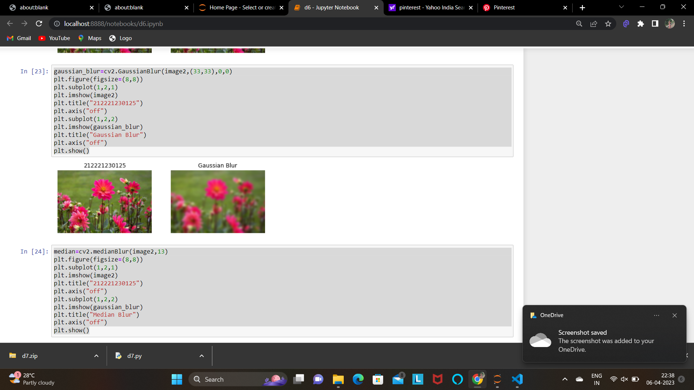

# Implementation-of-Filters
## Aim:
To implement filters for smoothing and sharpening the images in the spatial domain.

## Software Required:
Anaconda - Python 3.7

## Algorithm:
### Step1
</br>
</br> 

### Step2
</br>
</br> 

### Step3
</br>
</br> 

### Step4
</br>
</br> 

### Step5
</br>
</br> 

## Program:
### Developed By   : VISMAYA.S
### Register Number: 212221230125
</br>

# READING THE IMAGE :

```Python 
import cv2
import numpy as np
import matplotlib.pyplot as plt
image1 = cv2.imread('d6.jpeg')
image2 = cv2.cvtColor(image1,cv2.COLOR_BGR2RGB)
```

### 1. Smoothing Filters

i) Using Averaging Filter
```Python

kernel = np.ones((11,11),np.float32)/121
image3 = cv2.filter2D(image2,-1,kernel)
plt.figure(figsize = (9,9))
plt.subplot(1,2,1)
plt.imshow(image2)
plt.title("212221230125")
plt.axis('off')
plt.show()
plt.subplot(1,2,2)
plt.imshow(image3)
plt.title('average')
plt.axis('off')
plt.show()


```
ii) Using Weighted Averaging Filter
```Python

kernel1=np.array([[1,2,1],[2,4,2],[1,2,1]])/16
image3=cv2.filter2D(image2,-1,kernel1)
plt.figure(figsize=(8,8))
plt.subplot(1,2,1)
plt.imshow(image2)
plt.title("212221230125")
plt.axis("off")
plt.subplot(1,2,2)
plt.imshow(image3)
plt.title("Weighted Average")
plt.axis("off")
plt.show()


```
iii) Using Gaussian Filter
```Python

gaussian_blur=cv2.GaussianBlur(image2,(33,33),0,0)
plt.figure(figsize=(8,8))
plt.subplot(1,2,1)
plt.imshow(image2)
plt.title("212221230125")
plt.axis("off")
plt.subplot(1,2,2)
plt.imshow(gaussian_blur)
plt.title("Gaussian Blur")
plt.axis("off")
plt.show()


```

iv) Using Median Filter
```Python

median=cv2.medianBlur(image2,13)
plt.figure(figsize=(8,8))
plt.subplot(1,2,1)
plt.imshow(image2)
plt.title("212221230125")
plt.axis("off")
plt.subplot(1,2,2)
plt.imshow(gaussian_blur)
plt.title("Median Blur")
plt.axis("off")
plt.show()


```

### 2. Sharpening Filters
i) Using Laplacian Kernal
```Python
kernel2=np.array([[-1,-1,-1],[2,-2,1],[2,1,-1]])
image3=cv2.filter2D(image2,-1,kernel2)
plt.figure(figsize=(8,8))
plt.subplot(1,2,1)
plt.imshow(image2)
plt.title("212221230125")
plt.axis("off")
plt.subplot(1,2,2)
plt.imshow(image3)
plt.title("Laplacian Kernel")
plt.axis("off")
plt.show()


```
ii) Using Laplacian Operator
```Python

laplacian=cv2.Laplacian(image2,cv2.CV_64F)
plt.figure(figsize=(8,8))
plt.subplot(1,2,1)
plt.imshow(image2)
plt.title("212221230125")
plt.axis("off")
plt.subplot(1,2,2)
plt.imshow(laplacian)
plt.title("Laplacian Operator")
plt.axis("off")
plt.show()


```

## OUTPUT:

### 1. Smoothing Filters
</br>

i) Using Averaging Filter
</br>
</br>
</br>
</br>
</br>

ii) Using Weighted Averaging Filter
</br>
</br>
</br>
</br>
</br>

iii) Using Gaussian Filter
</br>
</br>
</br>
</br>
</br>

iv) Using Median Filter
</br>
</br>
</br>
</br>
</br>

### 2. Sharpening Filters
</br>

i) Using Laplacian Kernal
</br>
</br>
</br>
</br>
</br>

ii) Using Laplacian Operator
</br>
</br>
</br>
</br>
</br>

## Result:
Thus the filters are designed for smoothing and sharpening the images in the spatial domain.
